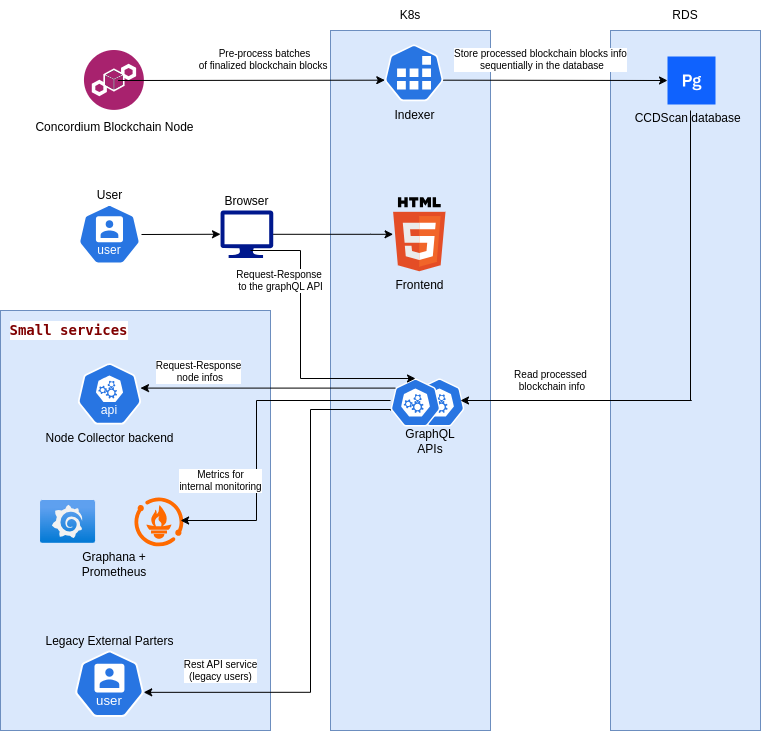

# CCDScan

## Component Interaction Diagram



[CCDScan](https://ccdscan.io) is a full blockchain explorer on [Concordium](https://www.concordium.com/).

It consists of two main parts:

- **[backend-rust/](./backend-rust/README.md)**  
  Backend built in Rust. It reads data directly from a blockchain node via gRPC, ingests it into a [PostgreSQL database](https://www.postgresql.org/), then serves it to any consumer from a [GraphQL](https://graphql.org/) API.
- **[frontend/](./frontend/README.md)**  
  A server-side rendered single page app written in [Vue](https://vuejs.org/) and [TypeScript](https://www.typescriptlang.org/), which consumes data from the [GraphQL](https://graphql.org/) endpoint exposed by the backend.

## Releasing the docker container images:

The project contains different [release pipelines](.github/workflows).

#### To release a new `backend` docker container image:

- Create a PR that bumps the backend version in the `backend-rust/Cargo.toml` file and updates the backend `changelog` and merge it e.g. [backend release](https://github.com/Concordium/concordium-scan/pull/536/files).
- Checkout the main branch locally.
- Tag the branch e.g.:
```
git tag ccdscan-backend/0.1.25
```
- Push the tag:
```
git push --tags
```
This will trigger a new release pipeline which needs to be approved before the image is published to docker hub [indexer](https://hub.docker.com/r/concordium/ccdscan-indexer/tags) and [graphQL API](https://hub.docker.com/r/concordium/ccdscan-api/tags).

#### To release a new `frontend` docker container image:

- Create a PR that bumps the frontend version in the `frontend/package.json` file and updates the frontend `changelog` and merge it e.g. [frontend release](https://github.com/Concordium/concordium-scan/pull/488/files).
- Checkout the main branch locally.
- Tag the branch e.g.:
```
git tag frontend/1.7.7
```
- Push the tag:
```
git push --tags
```
This will trigger a new release pipeline which needs to be approved before the image is published to docker hub [frontend](https://hub.docker.com/r/concordium/ccdscan-frontend/tags).